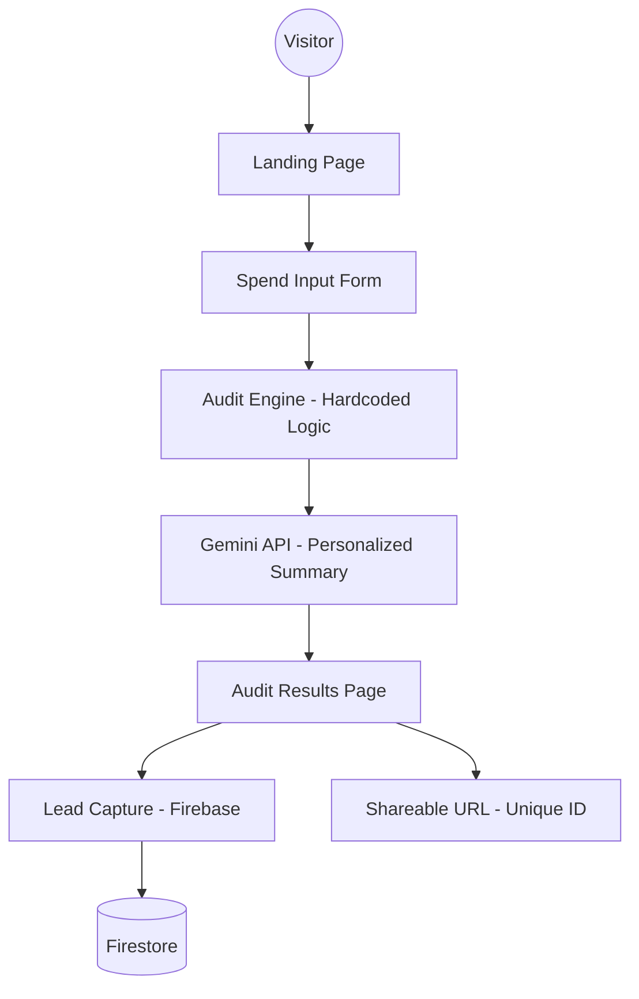

# ARCHITECTURE.md

## System Diagram

## Data Flow
1. **Input**: User provides tool mix, seats, and current spend via a React Hook Form. State is persisted in `localStorage`.
2. **Analysis**: The `AuditEngine` processes input against the `PricingData` dictionary. It applies heuristic rules (e.g., "Is individual plan plus API cheaper than Team plan for 3 users?").
3. **Augmentation**: The raw audit data is sent to Gemini (via `@google/genai`) to generate a human-readable, persuasive commentary.
4. **Persistence**: The audit result is stored in Firestore with a unique ID. PII (email) is stored separately from audit data to ensure public shared links remain anonymous.
5. **Output**: User views a high-fidelity dashboard with potential savings and CTAs for Credex credits.

## Stack Justification
- **React + Vite**: For a rapid, high-performance SPA experience.
- **Tailwind CSS + Shadcn/UI**: Provides the "Product Hunt" level polish with minimal custom CSS.
- **Firebase**: Handles both anonymous audit storage and secure lead capture without needing a custom backend.
- **Gemini 1.5 Flash**: Low-latency, high-quality text generation for personalized insights.

## Scalability (10k Audits/Day)
If we hit 10k audits/day:
1. **Edge Caching**: Deploy the Audit Engine as an Edge Function (Cloudflare/Vercel) to minimize latency.
2. **Rate Limiting**: Implement strict IP-based rate limiting on the Gemini generation endpoint.
3. **Batching**: Use Firestore batch writes for lead capture to handle write bursts.
4. **Static Generation**: Pre-render the Results pages for shared URLs using a CDN to avoid database calls for viral views.
